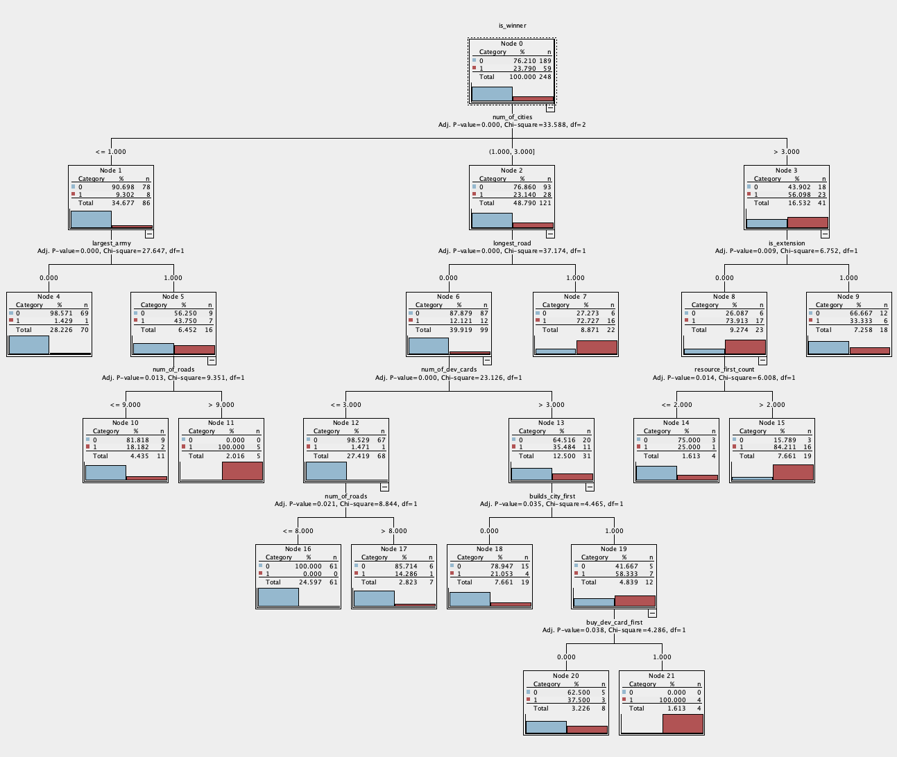
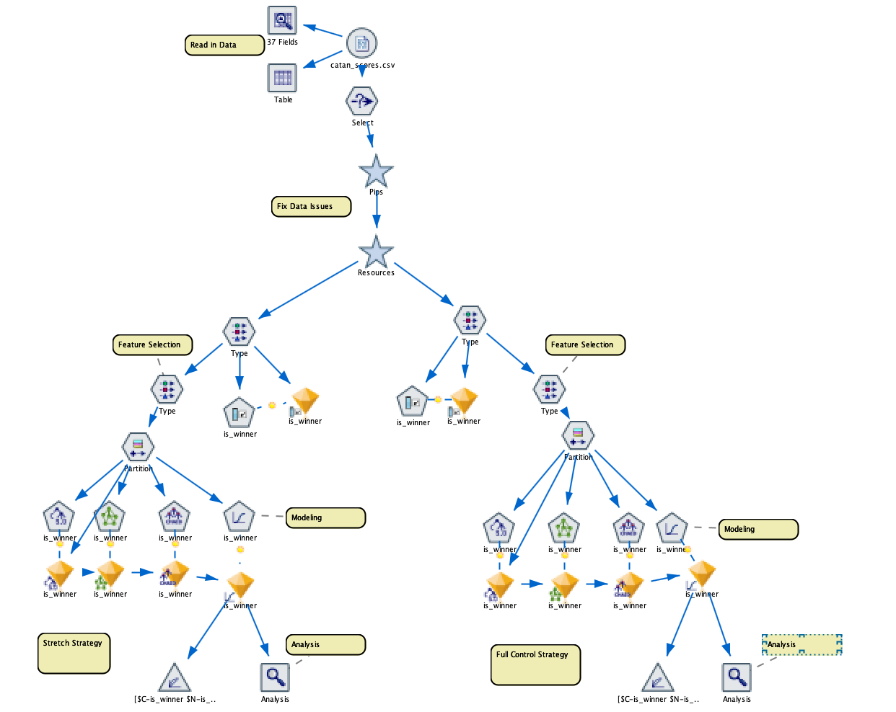

# Catan Strategy Discovery via Data Mining

[Download the full report](pdf/Catan_Report.pdf)

_**Project Overview**_  
This project leverages IBM SPSS Modeler to explore winning strategies in the board game *Settlers of Catan*. By applying classification algorithms to historical gameplay data, I identified key patterns that distinguish successful early-game and mid-to-late game decision-making.

The analysis involved:
- **Cleaning and preprocessing raw gameplay data** to ensure quality and consistency.
- **Transforming features** such as converting dice numbers into **pip values** to better represent resource production probabilities.
- Splitting features into **short-term actions** (e.g., initial placements, resource diversity) and **long-term goals** (e.g., Largest Army, Longest Road).
- Training multiple models (Logistic Regression, CHAID, C5.0, Neural Net) to predict game outcomes.
- Evaluating model performance using confusion matrices and gain charts to ensure reliability.
- Using modeling techniques to uncover both **early-game** and **mid-to-late game** strategies that lead to higher win probabilities.

_**Key Findings**_
- **Early-Game Strategy**: Winning players tend to maximize starting resource pips and prioritize ore/wheat/sheep access to enable early development card purchases.
- **Mid-to-Late Game Strategy**: Adaptive play is critical, strategies like pursuing Largest Army or pivoting to Longest Road are decisive depending on the game context.

  
*CHAID decision tree showing key features that separate winning and non-winning strategies.*

_**Tools Used**_
- IBM SPSS Modeler
- Classification modeling (CHAID, C5.0, Logistic Regression, Neural Networks)

## Next Steps

Future iterations of this project will:
- Expand the dataset
- Include features like trade behavior and robber mechanics
- Test strategy generalizability across different Catan variants
- Include clustering techniques to generalize distinct player archetypes

---

  
*SPSS Modeler stream used to process game data and run classification models.*
