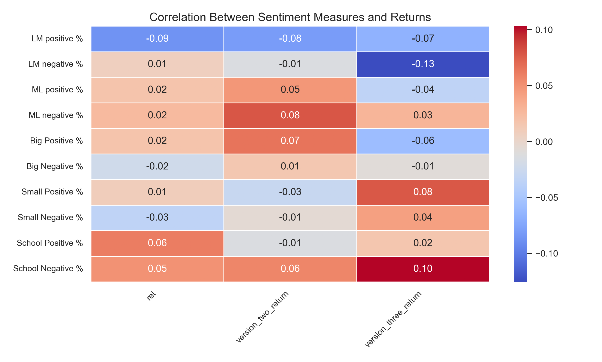
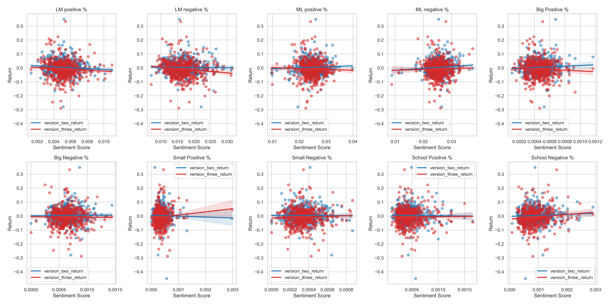
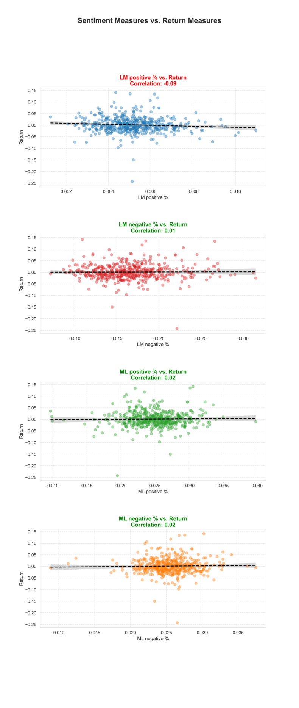
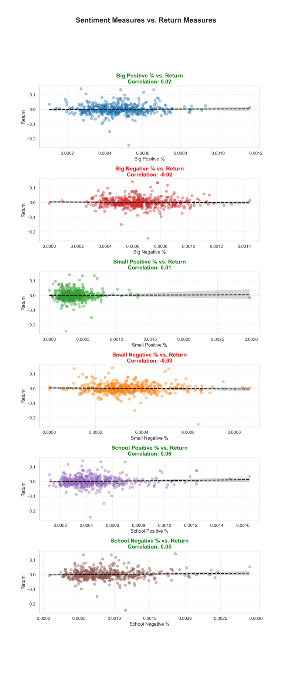
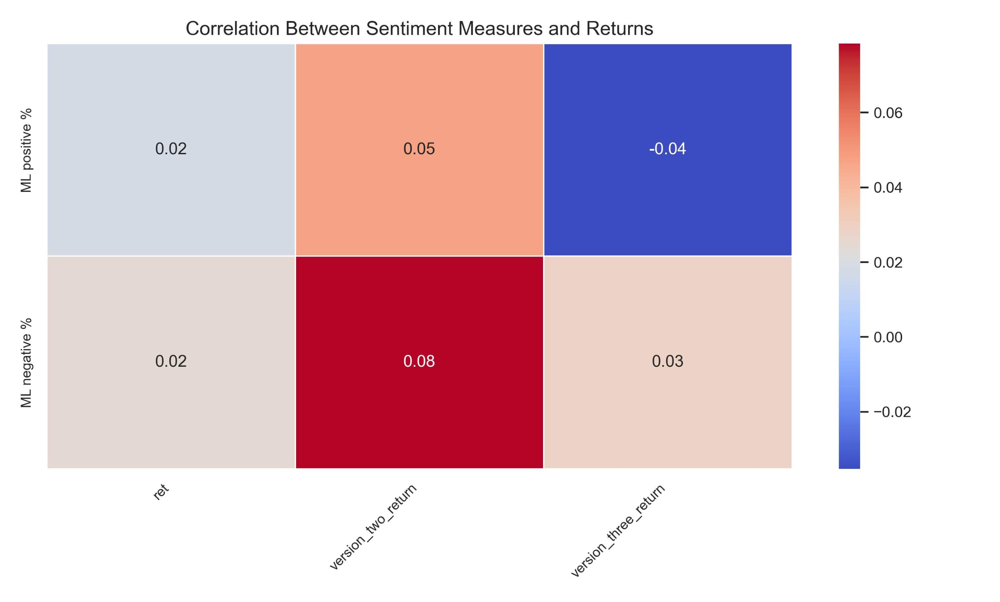

## Step 1: Establishing the Firm Set
We begin by defining the set of firms under consideration, which includes all S&P 500 firms that filed a 10-K in 2022. Each firm is identified by its ticker symbol, which is used as the key identifier throughout the process.

1. Retrieve a list of S&P 500 tickers from a reference file.
2. Ensure tickers are unique and correctly formatted.

```python
if not os.path.exists(sp500_file):
    # 2022 dec version of page
    url = 'https://en.wikipedia.org/w/index.php?title=List_of_S%26P_500_companies&oldid=1130173030'
    pd.read_html(url)[0].to_csv(sp500_file,index=False)
```

This step provides the foundation for all subsequent data retrieval and analysis.

---

## Step 2: Collecting and Processing 10-K Filings
For each firm in the S&P 500:

1. Retrieve the 10-K filing for 2022 from the SEC database.
2. Extract the filing date, which represents the date when the report was publicly available to the market.
3. Store the extracted dates in a structured format (e.g., a DataFrame with columns: ticker and filing date).

``` python
    for cik in tqdm(sp500['CIK']):
            dl.get("10-K", cik, 
                   limit=1,              
                   after="2022-01-01",      
                   before="2022-12-31",     
                   download_details =True    
            ) 
```
At this stage, we have a mapping of each firm's 10-K release date, which will later be used to align stock returns with key disclosure events.

---

## Step 3: Loading CRSP Return Data
Next, we retrieve daily return data for all S&P 500 firms from the CRSP database for the entire year 2022.

1. Ensure the dataset includes daily stock returns along with the corresponding trading dates.
2. Confirm that the date format in the return data matches the format of the extracted 10-K filing dates to enable proper merging.

```python
url = 'https://github.com/LeDataSciFi/data/blob/main/Stock%20Returns%20(CRSP)/crsp_2022_only.zip?raw=true'
with urlopen(url) as request:
    data = BytesIO(request.read())
with ZipFile(data) as archive:
    with archive.open(archive.namelist()[0]) as stata:
        ccm = pd.read_stata(stata)

ccm = ccm[['date', 'ticker', 'ret']]
```

This dataset serves as the basis for calculating stock price reactions to earnings disclosures.

---

## Step 4: Merging Filing Dates with CRSP Returns
To measure market reactions to each firm's 10-K filing, we align filing dates with daily stock returns:

1. Merge the filing date dataset with CRSP return data based on the firm’s ticker symbol.
2. Identify the return on the exact day of the 10-K filing, representing the market's immediate reaction.

```python
final_df = ccm.merge(df_filings, how="right", left_on=['ticker', 'date'], right_on=['ticker', 'Filing Date'], validate = 'one_to_one')
```
We merge right to maintain all of our filing data rows, using ticker and Filing date on our filings and matching with ticker and date from the returns, finally we validate knowing that it is one to one.

At this stage, we have a dataset that provides the filing date and return on the filing day for each firm.

---

## Step 5: Calculating Multi-Day Cumulative Returns
Since market reactions can extend beyond the filing date, we compute cumulative returns over two post-filing windows:

1. Short-term window (0-2 days): Measures the immediate reaction to the filing.
2. Medium-term window (3-10 days): Captures potential delayed responses as investors process the new information.

For each firm:
- Filter the CRSP return dataset to select all trading days within the specified windows.
- Compute the cumulative return for each window.

```python
for index, row in df_filings.iterrows():
    ticker = row['ticker']
    filing_date = row['Filing Date']

    version_two_subset = ccm[(ccm['date'] >= filing_date) & (ccm['ticker'] == ticker)].iloc[:3]
    version_three_subset = ccm[(ccm['date'] >= filing_date) & (ccm['ticker'] == ticker)].iloc[3:11]
    version_two_ret = (1 + version_two_subset['ret']).prod() - 1
    version_three_ret = (1 + version_three_subset['ret']).prod() - 1
    df_filings.at[index, 'version_two_return'] = version_two_ret
    df_filings.at[index, 'version_three_return'] = version_three_ret
```

This step ensures we capture both immediate and delayed investor reactions to financial disclosures.

---

## Step 6: Finalizing the Dataset
Once all return calculations are complete:

1. The final dataset is saved in a structured format (e.g., CSV or database table) for further analysis.

```python
final_df.to_csv('output/analysis_sample.csv', index=False)
```

At the end of this process, we have a comprehensive dataset linking 10-K filings with market reactions, which serves as the foundation for financial analysis.

---

## Summary of the Return Construction Process
1. Identify all S&P 500 firms and retrieve 10-K filing dates.
2. Obtain daily stock return data from CRSP for 2022.
3. Align filing dates with stock returns to get the return on the filing day.
4. Compute multi-day cumulative returns for the (0-2) day and (3-10) day windows.
5. Save the final dataset for further analysis.


## Sentiment Variable Construction and Modification

To build sentiment variables, we begin by using predefined lists of positive and negative words derived from machine learning (ML) models and Loughran and McDonald (LM). These models are trained to identify sentiment-bearing words, and the lists serve as the foundation for sentiment analysis on the 10-K filings.
```python
df = pd.read_csv("inputs/LM_MasterDictionary_1993-2021.csv")
LM_positive = df.loc[df["Positive"] > 0, "Word"].tolist()

LM_positive = [e.lower() for e in LM_positive]
```

This is an example for how LM positive was created, the other 3 were created the same way.

#### First 4 Sentiment Scores
We create a regular expression (regex) to search through each 10-K filing for any of the words in the positive and negative word lists. The sentiment score is calculated as the percentage of sentiment-bearing words (positive or negative) that appear in the document. The percentage is used to normalize the sentiment score, ensuring that longer documents do not disproportionately affect the score.

```python
        LM_pos_regex = r'\b('+'|'.join(LM_positive) + r')\b'
        
        LM_pos_hits = len(re.findall(LM_pos_regex, cleaned)) / len(cleaned.split())
```

This is an example for how LM positive was created, the other 3 were created the same way.

#### Additional 6 Sentiment Scores
Next, we expand our analysis to include three thematic categories of words: words related to size (e.g., large, small) and words related to school (e.g., academic, education). For each of these categories, we look for instances where words from these categories appear near positive or negative words. We use a "near regex" approach, ensuring that words from these categories are close enough (within a specific window) to influence the sentiment score.

Word list creation:
```python
big_words = [
    "large", "big", "significant", "substantial", "major", "massive", "extensive", 
    "considerable", "widespread", "high", "enormous", "vast", "huge", "great", 
    "elevated", "immense", "tremendous", "record", "notable", "exceptional", "prominent"
]
```
In for loop:
```python
        big_pos_hits = NEAR_finder(big_words, ML_positive, cleaned)[0] / len(cleaned.split())
```

In summary, sentiment scores are created by combining the ML-derived sentiment word lists with thematic categories of words, all filtered through regular expressions and proximity measures. These enriched sentiment scores are then used as features for further analysis.

We loop through each of our 10-K files by ticker and create sentiment scores for each of them. Once all of that info is gathered it is appeneded to a list and then created into a data frame at the end to get our base information about filing and sentiment.

In the for loop:
```python
        filing_data.append({
            "ticker": firms['Symbol'][firms['CIK'].tolist().index(firm)],
            "CIK": firm,
            "Accession Number": accession_number,
            "Filing Date": date.text,
            "LM positive %": LM_pos_hits, 
            "LM negative %": LM_neg_hits, 
            "ML positive %": ML_pos_hits, 
            "ML negative %": ML_neg_hits,
            "Big Positive %": big_pos_hits,
            "Big Negative %": big_neg_hits,
            "Small Positive %": small_pos_hits,
            "Small Negative %": small_neg_hits,
            "School Positive %": school_pos_hits,
            "School Negative %": school_neg_hits,
        })
```
After the for loop:
```python
df_filings = pd.DataFrame(filing_data)
```


### Sentiment Variables - Data Points and Setup

#### Word Counts in Sentiment Dictionaries
- **LM Positive Dictionary**: 347 words
- **LM Negative Dictionary**: 2,345 words
- **ML Positive Dictionary**: 75 words
- **ML Negative Dictionary**: 94 words

#### Near Regex Function Setup
The `near_regex` function was set up with the following parameters:
- **Partial**: `False`. This ensures that we only match complete words from the dictionaries, not substrings within larger words. For example, we do not want to mistakenly match the word "big" within the word "bigger."
- **Distance**: `5`. Initially, I experimented with larger distances, but I found that the words I was using were common and began picking up unrelated words from other sentences. After testing different values, I found that a base distance of 5 provided the best balance between relevance and precision for matching big or small positive and negative words.


### Reasoning Behind the Choice of Contextual Sentiment Topics

The three topics chosen for contextual sentiment measures were selected based on curiosity about how specific word categories might impact sentiment and, ultimately, financial outcomes such as return.

- **Large Magnitude Words**: I was particularly interested in how the use of high-magnitude words (e.g., "huge," "enormous," "massive") might impact the intensity of sentiment in a 10-K. My hypothesis was that large words, when paired with positive words, could amplify the positive sentiment and increase their effect on returns. I wanted to explore whether these high-magnitude words had a meaningful relationship with returns when associated with positive sentiments.

- **Small Magnitude Words**: On the other hand, I also wanted to see if small magnitude words (e.g., "tiny," "slight," "minimal") could mitigate the impact of negative words. The idea was that small words, when paired with negative sentiments, might reduce the perceived severity of the negative sentiment and potentially influence the returns in a different way.

- **School Words**: The third category focuses on terms related to education and academia (e.g., "university," "degree," "scholar"). I chose this topic because I believed it would provide a stand-alone sentiment category. My intuition was that school-related words would often be associated with positivity, as they typically symbolize intelligence, expertise, and a formal path to success. I wanted to investigate whether the use of these words in filings correlated with more favorable sentiment.

These categories were chosen to test whether sentiment measures, when combined with contextual information such as word magnitude or academic references, could offer more insight into a company's performance and its effect on returns.


### Summary Statistics

- **LM Positive %**: The mean value is 0.0052, which is quite low, suggesting that the 10-K filings contain only a small percentage of words from the Loughran and McDonald (LM) positive word list. The maximum observed is 0.01096, indicating a few filings with slightly higher positive sentiment.

- **LM Negative %**: With a mean of 0.0167, this is higher than the positive sentiment, which is expected since 10-Ks are typically more neutral or even negative in tone. The range (min: 0.0071, max: 0.0315) shows variation, with some filings having a larger proportion of negative words.

- **ML Positive %**: The mean is 0.0248, which is slightly higher than the LM positive sentiment. This indicates a larger presence of positive sentiment from the machine learning positive word list compared to LM. The maximum value (0.0398) corresponds to a few filings with notable positive sentiment.

- **ML Negative %**: The ML negative sentiment, with a mean of 0.0254, is slightly higher than the positive sentiment, indicating that the ML negative word list captures a higher proportion of negative sentiment in these filings. The range (min: 0.0088, max: 0.0375) is relatively tight.

- **Big Positive %**: The mean is 0.0005, a very small value, suggesting that high-magnitude positive words (e.g., large positive words) appear infrequently. The maximum observed value is 0.0012, which still reflects the rarity of such words in 10-K filings.

- **Big Negative %**: Similar to the Big Positive % variable, the mean is small (0.0006), showing that high-magnitude negative words are also relatively rare in the filings. The maximum value is 0.0014, indicating occasional occurrences of such words.

- **Small Positive %**: This value has a mean of 0.0004, which is also very low, suggesting that small, positive words don’t appear frequently in 10-Ks. The maximum value of 0.003 indicates that some filings contain a slightly larger proportion of small positive words.

- **School Positive %**: With a mean of 0.0005, this indicates that words related to academia and education (associated with positive sentiment) are generally rare in the filings. The maximum of 0.0017 shows that such terms occasionally appear.

- **School Negative %**: Similar to School Positive %, the mean is low (0.0003), reflecting that school-related terms with negative sentiment are even rarer in the 10-K filings. The maximum value of 0.0017 indicates occasional use of such terms.

### Returns

- **Version Two Return**: This return metric has a mean of 0.0009, suggesting a small average return for the sample. The max return observed is 0.1419, but there is significant variation, with a minimum return of -0.2428, indicating considerable downside risk in the sample.

- **Version Three Return**: The mean for this return is -0.0075, which shows a slightly negative average return across the sample. The range (-0.4475 to 0.3323) suggests substantial volatility, with some filings resulting in large negative returns and others in sizable positive returns.


### Contextual Sentiment Smell Tests

- **Variation in Measures**: The contextual sentiment measures exhibit sufficient variation across the dataset. The means, standard deviations, and range statistics for each sentiment measure (Big Positive %, Big Negative %, Small Positive %, Small Negative %, School Positive %, and School Negative %) show variability. For example, the Big Positive % has a mean of 0.0005 and a max of 0.0012, while the Small Negative % has a mean of 0.0006 and a max of 0.0029. This suggests that the measures are not uniform and show a degree of variation across different 10-K filings.

- **Industries and Sentiment**: The industries that are expected to have certain sentiment values in their 10-K filings appear to align with expectations. For example, industries that deal with large-scale projects or businesses are likely to mention “big” words, and the sentiment here should lean positively or negatively depending on the context of the industry. Industries in tech or education might show a higher frequency of "school" related words, which should have a generally positive sentiment (as schools and academia are associated with knowledge and progress). A closer inspection of specific industries and their corresponding sentiment values will confirm if these assumptions hold true.

### Additional Considerations

- **Big Words (Big Positive and Big Negative)**: Given that words with larger magnitudes (e.g., "immense," "massive," "gigantic," for positive or "destructive," "devastating," for negative) are less frequent in filings, it is expected that the Big Positive and Big Negative % variables would have lower values across the board. The small values for these variables are consistent with this assumption, suggesting no red flags.

- **Small Words (Small Positive and Small Negative)**: Small words may be more frequent, but their impact on sentiment is relatively less noticeable. Their low mean percentages also seem appropriate. There is no indication of these variables being excessively skewed or giving unrealistic results.

- **School Sentiment**: The “School” words seem reasonable as a positive measure, given the academic and knowledge-associated connotations of such terms. Negative school-related words should be rare, and the results reflect that as well.

Overall, the contextual sentiment measures pass the basic smell tests, showing variability and aligning with expected industry patterns. There’s no indication of anything fishy in the methodology or results.


# Results


```python
plt.figure(figsize=(36, 24)) 
plt.imshow(corrheat)
plt.axis("off") 
plt.show()
```


    

    


```python
plt.figure(figsize=(36, 24)) 
plt.imshow(scatters)
plt.axis("off")  
plt.show()
```


    

    


```python
plt.figure(figsize=(36, 24)) 
plt.imshow(firstfour)
plt.axis("off") 
plt.show()
```


    

    


# Comparison of LM Sentiment vs. ML Sentiment in Relation to Returns

When analyzing the correlation between sentiment measures and returns, we observe that LM Positive shows a negative correlation (-0.09), which is opposite to our expectation that positive sentiment should correlate with positive returns. Similarly, LM Negative (0.01) and ML Negative (0.02) both show positive correlations, contrary to the expectation that negative sentiment would correlate with negative returns. The only sentiment measure that aligns with expectations is ML Positive (0.02), which shows a small positive correlation with returns.

A notable point is the strongest negative correlation from LM Positive (-0.09), which is concerning, as it contradicts the assumption that positive sentiment should have a positive impact on returns. The large difference in correlation between LM Positive (-0.09) and LM Negative (0.01) suggests that LM might still be a useful differentiator of sentiment within 10-K filings, even if the signs are unexpected.

After analyzing these results, it would be helpful to check the original literature and consider how we could improve the sentiment analysis approach for better alignment with expected patterns.


# Comparison to Literature

In general we could describe the results we obtained here to be the opposite of what we would have expected, and less correlated than we would have hoped for. A paper written on the ML words was published with their results, and can be a potential control for our results. 

1. **LM Positive Sentiment**:
   - **Paper Results**: Negative correlation (-0.14, -0.14, -0.13) with returns, significant at the 5% level.
   - **Our Results**: Negative correlation (-0.09), but not as significant.

2. **LM Negative Sentiment**:
   - **Paper Results**: Mixed results, with a small negative (-0.06) in model 1 and positive in models 2 and 3 (0.03, 0.01), only significant in model 1.
   - **Our Results**: Small positive correlation (0.01), which is consistent with the mixed results from Table 3.

3. **ML Positive Sentiment**:
   - **Paper Results**: Strong positive correlation (0.11, 0.13, 0.05), significant at the 1% level in models 1 and 2.
   - **Our Results**: Positive correlation (0.02), but less significant than Table 3.

4. **ML Negative Sentiment**:
   - **Paper Results**: Small negative correlation (-0.05, -0.01), not significant.
   - **Our Results**: Positive correlation (0.02), opposite of the negative correlation in Table 3 but both are not largely significant.


### Key Takeaways:
- **LM Positive** is negatively correlated in both results, though the paper data shows stronger significance.
- **LM Negative** showed mixed results, with our findings showing a positive correlation.
- **ML Positive** had a stronger positive correlation in the paper data, while our result was smaller.
- **ML Negative** was negative in the paper but positive in ours, showing a discrepancy in sentiment measurement.


### Reasons for Differences in Results

If the results conflict with those in Table 3 of the Garcia, Hu, and Rohrer paper, the main reasons for the differences could be the sample size and time period, as well as the inclusion of additional controls. The paper uses a significantly larger dataset with 76,922 observations from 1995 to 2018, which provides greater statistical power and makes the results more robust. In contrast, the smaller sample and time frame in the analysis here might not capture as many market variations. Additionally, the paper includes more controls, such as standardized unexpected earnings, firm size, book-to-market ratio, and fixed effects for industry and quarter-year, which help ensure that the relationship between sentiment and returns is not impacted by other factors.

The difference in the event window between our analysis and the paper's analysis could have an impact on the significance of our results. While we are focusing on day-of returns, the paper uses a 4-day event window, which includes not only the event day but also the surrounding days. This extended window could capture broader market trends and delayed reactions to the sentiment expressed in earnings calls and 10-K filings. As a result, the additional days in the paper's window may allow for market information to gradually incorporate into stock prices, potentially leading to different significance levels compared to the day-of returns analysis, which might not fully capture these delayed effects.


# Sentiment Measure Analysis


```python
plt.figure(figsize=(36, 24)) 
plt.imshow(sentiment)
plt.axis("off") 
plt.show()
```


    

    


The three "contextual" sentiment measures big positive, big negative, small positive, small negative, school positive, and school negative—show correlations with returns that warrant further investigation.

School positive (0.06) and school negative (0.05) both show positive correlations, suggesting that sentiment around educational institutions may influence market returns. Positive news may signal bigger growth, while negative sentiment still has a modest positive effect.

Big positive (0.02) and small positive (0.01) show weak positive correlations, while big negative (-0.02) and small negative (-0.03) show weak negative correlations. This aligns with typical market behavior where negative sentiment leads to lower returns.

When compared to the ML positive (0.02) and ML negative (0.02) correlations, the contextual measures are better at capturing negative sentiment with no impact on the efficacy of capturing positive sentiment. This aligns with the original hypothesis that measures of magnitude help give context to positive and negative words.

The overall positive relation between school words and returns as well as the abillity of magintude to better capture sentiment implies that all three of these contextual sentiments are worth further investigation.


# Impact on Return Window and Correlation


```python
plt.figure(figsize=(36, 24)) 
plt.imshow(returnheat)
plt.axis("off")
plt.show()
```


    

    


For ML positive sentiment, the correlation with ret (day-of return) is positive (0.0182), and it strengthens for version_two_return (0.0470), but becomes negative for version_three_return (-0.0353). This suggests that in the short-term, positive sentiment leads to a slight positive return, but over the longer window (3-10 days), the relationship turns negative. The initial optimism may drive a quick reaction, but as the sentiment fades or turns out to be overstated, the longer-term returns may decrease, indicating a potential overreaction or a market correction.

For ML negative sentiment, the correlation with ret is positive (0.0249), and it becomes stronger for version_two_return (0.0784). This could indicate that negative sentiment, while seemingly undesirable in the short term, may eventually lead to positive returns over a couple of days. Investors may interpret negative sentiment, particularly from a 10-K filing, as a potential opportunity for undervaluation, especially if they believe the stock could recover or is oversold in the short term. Additionally, markets typically trend upwards over time, and this positive correlation could be a result of the broader market momentum. The correlation decreases slightly for version_three_return (0.0289), but it remains positive, suggesting that negative sentiment may trigger an initial drop followed by a rebound as investors swoop in, expecting the stock to return to a more reasonable price.

This pattern shows that ML positive and negative sentiment are linked to different dynamics in short and long-term returns, with positive sentiment creating short-term optimism but long-term correction, while negative sentiment may present buying opportunities due to potential undervaluation and market trends.

